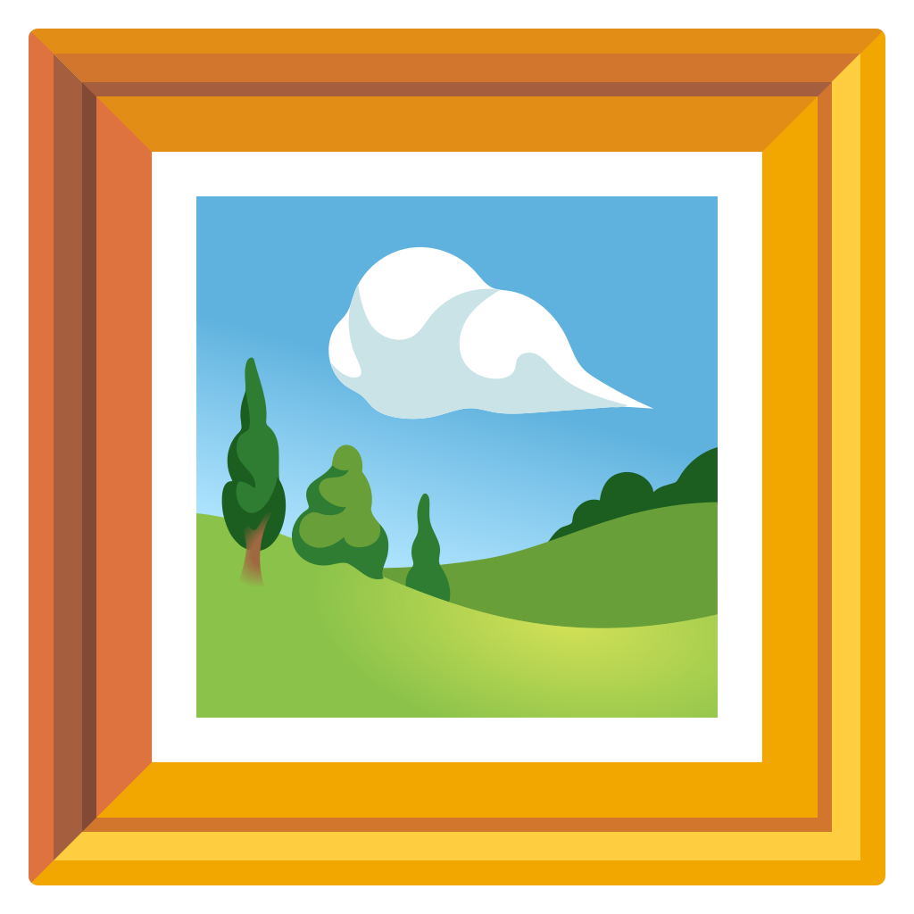
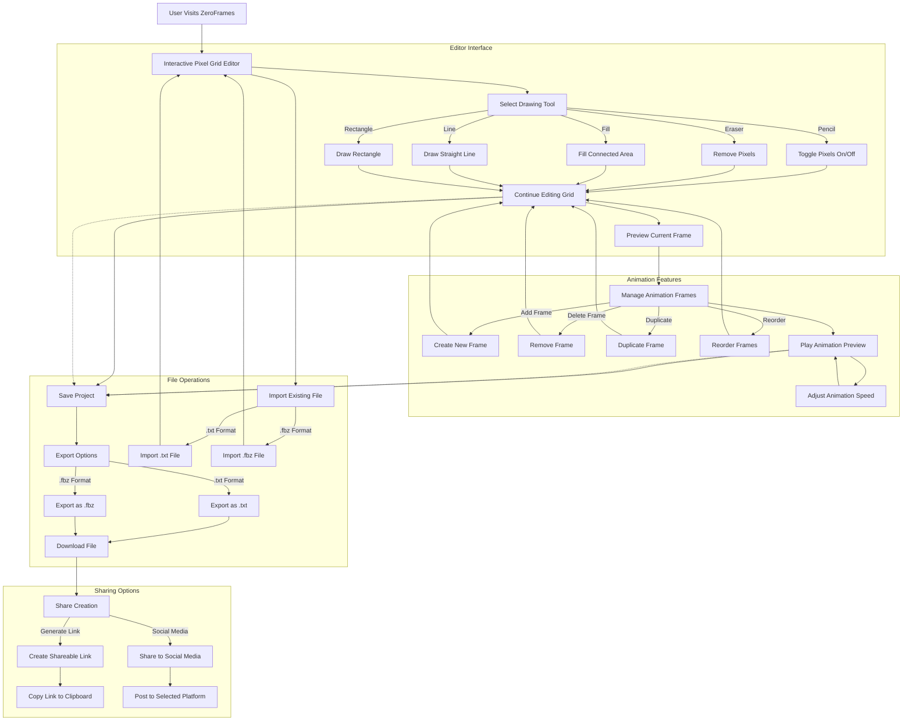

<p align="center">
  
</p>
<h1 align="center">
  ZeroFrames
</h1>

---

> ⭐️ Thanks **everyone** who has starred the project, it means a lot!

🖼️ [ZeroFrames](https://opencollective.com/zeroframes): create your own designs (assets) for the Flipper Zero device.

[](https://github.com/ZeroFrames/ZeroFrames/actions)
[](https://www.gnu.org/licenses/lgpl-3.0)
[](https://github.com/ZeroFrames/ZeroFrames/issues)
[](https://github.com/ZeroFrames/ZeroFrames/pulls)
[](http://makeapullrequest.com)
[](http://www.firsttimersonly.com/)


## Table of content
<details>
<summary>Expand contents</summary>

- [Overview](#overview)
- [News](#news)
- [Installation for Developers](#installation-for-developers)
- [Features](#features)
- [Contributing](#contributing)

</details>

## Overview

ZeroFrames is an easy-to-use tool for creating custom graphics for your Flipper Zero. You can design icons, frames, and other visuals to personalize your device. The tool lets you preview your designs in real-time, export them easily, and even share them with others.

## News

- 🖼️ Created ZeroFrames icon


## Installation for Developers

1. Clone repository:

```bash
git clone https://github.com/ZeroFrames/ZeroFrames.git
```

2. Create and activate virtual environment:

```bash
python -m venv .venv
source .venv/bin/activate  # On Windows: .venv\Scripts\activate
```

3. Install dependencies:

```bash
pip install -r requirements.txt
```

4. Run the ZEROFRAMES

```bash
cd core
```

```bash
python3 manage.py runserver
```


## Features

- 🛠️ [Custom Asset Creation](https://github.com/ZeroFrames/ZeroFrames/issues/2) – Design your own frames, icons, and UI elements for the Flipper Zero.

- 📂 [Multi-Format Support](https://github.com/ZeroFrames/ZeroFrames/issues/5) – Export assets in compatible formats for easy integration with Flipper firmware.

- [🖌️ User-Friendly Editor](https://github.com/ZeroFrames/ZeroFrames/issues/3) – Intuitive interface for drawing and modifying designs with pixel precision.

- [📡 Live Preview](https://github.com/ZeroFrames/ZeroFrames/issues/6) – See real-time updates on how your assets will look on the Flipper Zero screen.

- [📁 Asset Library](https://github.com/ZeroFrames/ZeroFrames/issues/7) – Store and manage your designs in an organized collection.

- [💾 Easy Export & Import](https://github.com/ZeroFrames/ZeroFrames/issues/10) – Seamlessly transfer assets to your Flipper Zero via USB or SD card.

- [🎭 Community Sharing](https://github.com/ZeroFrames/ZeroFrames/issues/9) – Upload and download assets from a growing repository of user-made designs.

- [🔄 Compatibility Check](https://github.com/ZeroFrames/ZeroFrames/issues/4) – Ensure your assets meet Flipper Zero’s display and performance constraints.

- [🚀 Optimized for Performance](https://github.com/ZeroFrames/ZeroFrames/issues/8) – Keep your assets lightweight and efficient for smooth performance.

## User Flow



---


## Contributing

Contributions are welcome! Please feel free to submit a Pull Request.

<a href="https://github.com/DeepBlackHole/ZeroFrames/graphs/contributors">
  
</a>
